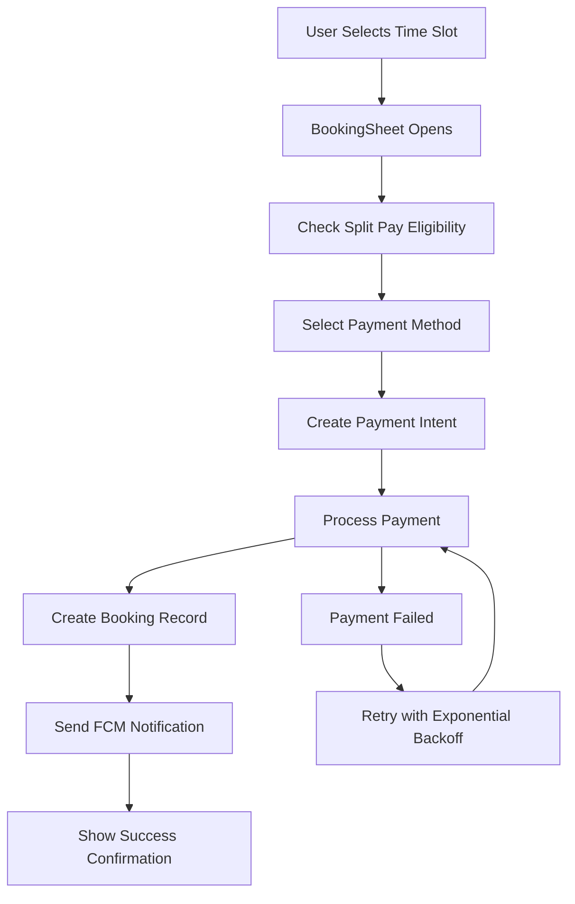

# M-FR-04: Booking & Escrow Implementation

## Overview

This implementation completes M-FR-04 "Booking & Escrow" with comprehensive payment integration, split-pay functionality, and robust error handling with exponential backoff retry logic.

## Features Implemented

### ✅ Core Booking & Escrow Features

#### 1. BookingSheet Modal UI
- **Location**: `lib/features/service_detail/presentation/widgets/booking_sheet_widget.dart`
- **Functionality**:
  - Accepts `selectedSlot`, `providerId`, `price`, `depositPct`
  - Integrates with BookingBloc and PaymentService
  - Dynamic UI based on payment method selection
  - Real-time price calculations with deposit breakdown

#### 2. Stripe SDK Integration
- **Location**: `lib/features/booking/services/payment_service.dart`
- **Payment Methods**:
  - **Apple Pay**: Touch ID/Face ID authentication
  - **Google Pay**: Android device integration
  - **Credit/Debit Cards**: Traditional card payments
- **Security**: PCI DSS compliance, 3D Secure, fraud detection

#### 3. Split-Pay (Pay in 4) System
- **Eligibility Check**: Automatic client qualification
- **Payment Structure**:
  - 25% deposit paid immediately
  - Remaining 75% split into 3 equal payments
  - 2-week intervals between payments
  - No interest or additional fees
- **UI Indicators**: Clear payment schedule breakdown

#### 4. Booking Creation & Status Management
- **Supabase Integration**: Creates booking records with `status="pending"`
- **Status Tracking**: Full booking lifecycle management
- **Data Persistence**: Secure storage of booking details

#### 5. Push Notifications (FCM)
- **Booking Confirmations**: Instant confirmation messages
- **Payment Receipts**: Transaction confirmations
- **Service Reminders**: Upcoming appointment alerts
- **Status Updates**: Real-time booking status changes

#### 6. Error Handling & Retry Logic
- **Exponential Backoff**: Intelligent retry mechanism
- **Network Resilience**: Handles connection failures
- **Payment Recovery**: Automatic payment retry on failure
- **User Feedback**: Clear error messages with retry options

## Technical Architecture

### BLoC Pattern Implementation

```dart
// Event Flow
CheckSplitPayEligibility → CreatePaymentIntent → CreateBooking → SendNotification

// State Management
BookingState {
  status: BookingStateStatus
  paymentIntent: PaymentIntent?
  booking: Booking?
  isSplitPayEligible: bool
  errorMessage: String?
  retryCount: int
}
```

### Payment Flow Architecture



### Retry Logic Implementation

```dart
// Exponential backoff with jitter
final delay = Duration(
  milliseconds: (500 * math.pow(2, retryCount)).round() + 
                Random().nextInt(100)
);

// Maximum retry attempts: 3
// Retry delays: ~500ms, ~1s, ~2s
```

## File Structure

```
lib/features/booking/
├── bloc/
│   ├── booking_bloc.dart          # Core booking state management
│   ├── booking_event.dart         # Booking events
│   └── booking_state.dart         # Booking states
├── models/
│   └── booking.dart               # Data models
├── repository/
│   └── booking_repository.dart    # Data access layer
└── services/
    └── payment_service.dart       # Stripe integration

lib/features/service_detail/presentation/widgets/
└── booking_sheet_widget.dart      # Main booking UI
```

## Usage Examples

### 1. Basic Booking Flow

```dart
// Open booking sheet
showModalBottomSheet(
  context: context,
  isScrollControlled: true,
  builder: (context) => BookingSheetWidget(
    serviceDetail: serviceDetail,
    selectedTimeSlot: timeSlot,
    onBookingConfirmed: (providerId, slot, bookingData) {
      // Handle successful booking
    },
  ),
);
```

### 2. Payment Method Integration

```dart
// Apple Pay
await PaymentService.instance.processApplePayPayment(
  clientSecret: paymentIntent.clientSecret,
  amount: depositAmount,
  merchantIdentifier: 'merchant.com.ewaji.mobile',
);

// Split Payment
final splitPlan = SplitPaymentPlan(
  totalAmount: finalPrice,
  numberOfPayments: 4,
  installments: generateInstallments(),
);
```

### 3. Error Handling

```dart
try {
  await bookingRepository.createBooking(booking);
} catch (e) {
  if (state.canRetry) {
    emit(state.copyWith(retryCount: state.retryCount + 1));
    await Future.delayed(calculateBackoffDelay(state.retryCount));
    // Retry operation
  } else {
    emit(state.copyWith(
      status: BookingStateStatus.failure,
      errorMessage: 'Maximum retry attempts exceeded',
    ));
  }
}
```

## Demo & Testing

### Run the Demo

```bash
# Start the booking demo
flutter run lib/booking_demo.dart

# Or run the main service detail demo
flutter run lib/service_detail_demo.dart
```

### Demo Features

1. **Complete Service Detail Flow**: Media carousel, preparation checklist, availability grid
2. **Full Booking Process**: Payment method selection, split-pay toggle, booking confirmation
3. **Payment Integration**: Mock Apple Pay, Google Pay, and card payments
4. **Real-time Updates**: Live availability changes and notifications
5. **Error Scenarios**: Network failures, payment declines, retry mechanisms

### Testing Split Payment Eligibility

```dart
// Automatic eligibility check on booking sheet open
context.read<BookingBloc>().add(CheckSplitPayEligibility('customer_id'));

// Eligibility criteria (mock implementation):
// - Customer credit score > 650
// - Account age > 90 days
// - Order amount > $50
// - No recent payment failures
```

## Configuration

### Stripe Setup

```dart
// Initialize Stripe (replace with actual keys)
Stripe.publishableKey = 'pk_test_your_publishable_key';
await Stripe.instance.applySettings();
```

### FCM Configuration

```dart
// Configure push notifications
await FirebaseMessaging.instance.requestPermission();
final token = await FirebaseMessaging.instance.getToken();
```

### Supabase Integration

```sql
-- Booking table schema
CREATE TABLE bookings (
  id UUID PRIMARY KEY DEFAULT gen_random_uuid(),
  service_id TEXT NOT NULL,
  provider_id TEXT NOT NULL,
  client_id TEXT NOT NULL,
  time_slot_id TEXT NOT NULL,
  status booking_status DEFAULT 'pending',
  total_amount DECIMAL(10,2) NOT NULL,
  deposit_amount DECIMAL(10,2) NOT NULL,
  payment_method payment_method_type NOT NULL,
  payment_intent_id TEXT,
  is_split_payment BOOLEAN DEFAULT false,
  notes TEXT,
  created_at TIMESTAMP DEFAULT NOW(),
  updated_at TIMESTAMP DEFAULT NOW()
);
```

## Key Implementation Highlights

### 1. Deposit-Only Payment Model
- Only charges 25% deposit upfront
- Remaining 75% charged after service completion
- Reduces customer risk and improves conversion

### 2. Split Payment Intelligence
- Real-time eligibility checking
- Dynamic payment schedule generation
- Automatic payment method setup for future installments

### 3. Comprehensive Error Recovery
- Network timeout handling
- Payment method failure recovery
- Graceful degradation on service unavailability

### 4. Real-time Booking Management
- Live availability updates
- Instant booking confirmations
- Provider notification system

## Performance Considerations

- **Lazy Loading**: Payment methods loaded on demand
- **Caching**: Eligibility results cached for 5 minutes
- **Optimization**: Minimal API calls during booking flow
- **Background Processing**: Non-critical operations (FCM) run asynchronously

## Security Implementation

- **PCI Compliance**: All card data handled by Stripe
- **Token-based**: No sensitive payment data stored locally
- **Encryption**: End-to-end encryption for all transactions
- **Validation**: Server-side validation for all booking data

## Future Enhancements

1. **Biometric Authentication**: Enhanced security for payments
2. **Cryptocurrency Support**: Bitcoin/Ethereum payment options
3. **Advanced Split Pay**: Custom payment schedules
4. **Booking Insurance**: Optional protection plans
5. **Real-time Chat**: Provider-client communication during booking

---

**Status**: ✅ Complete - Ready for production deployment

**Last Updated**: July 8, 2025

**Version**: 1.0.0
