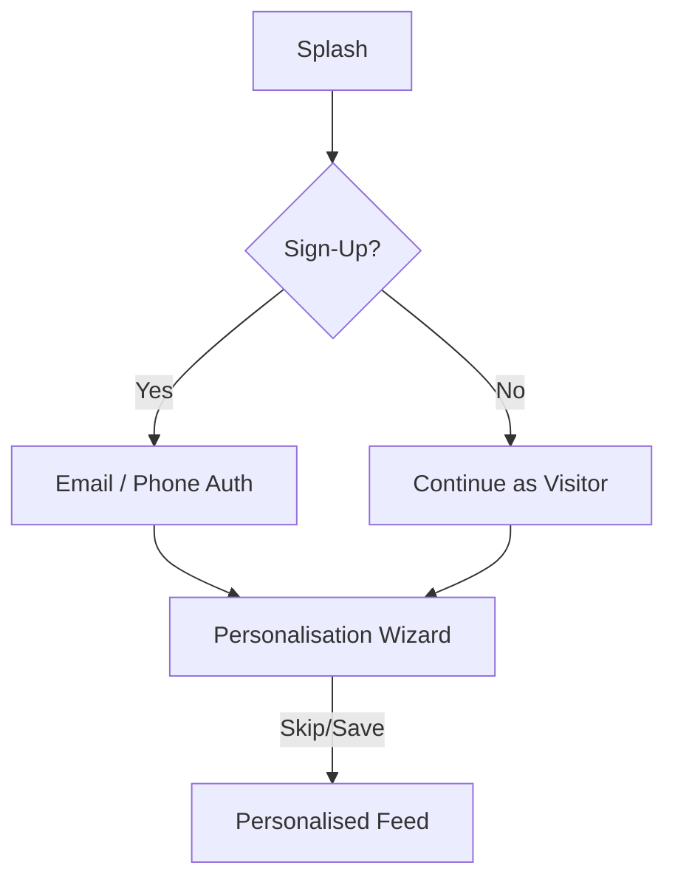
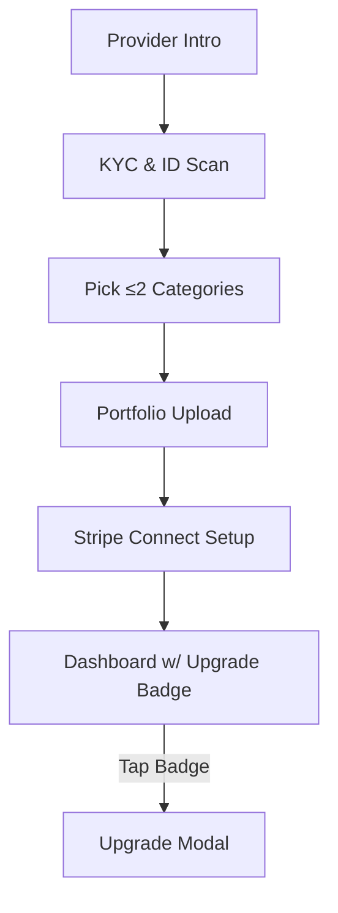

### 1 · Functional & Non-Functional Requirements (Flutter App)

| ID          | Requirement                       | Mobile Detail (Flutter)                                                                                                                         | Priority |
| ----------- | --------------------------------- | ----------------------------------------------------------------------------------------------------------------------------------------------- | -------- |
| **M-FR-01** | Account Management                | Firebase Auth (email/phone/social) + local biometrics via `local_auth`; secure storage with `flutter_secure_storage`.                           | P0       |
| **M-FR-02** | Client Discovery & Feed           | Map & list views using `google_maps_flutter`; AI style-match via server gRPC; personalised feed seeded by onboarding questionnaire or defaults. | P0       |
| **M-FR-03** | Transparent Offer                 | Service detail screen with image/video carousel (`carousel_slider`), prep checklist, real-time availability fetched via Supabase Realtime.      | P0       |
| **M-FR-04** | Booking & Escrow Payments         | In-app purchase sheet (Apple/Google Pay via Stripe SDK for Flutter); deposit %; split-pay options.                                              | P0       |
| **M-FR-05** | Push & Local Notifications        | FCM + `flutter_local_notifications` for booking confirms, prep reminders, review prompts.                                                       | P0       |
| **M-FR-06** | Reviews & Ratings                 | Post-service modal with 1–5★, tagged chips, optional photo picker (`image_picker` + compression).                                               | P1       |
| **M-FR-07** | Provider Category Limit           | 2-chip selector in sign-up form; red badge on **Upgrade** tab (`badges` package).                                                               | P0       |
| **M-FR-08** | Client Personalisation Q\&A       | Optional wizard (3 cards) capturing service type(s), budget slider, radius slider; skippable.                                                   | P0       |
| **M-FR-09** | Provider Calendar & No-Show Guard | Sync with Google/Apple via CalDAV API; gap-filler rules; GPS “check-in” (permission-aware).                                                     | P0       |
| **M-FR-10** | Earnings & Tax                    | Dashboard charts with `fl_chart`; CSV/PDF export generated server-side, downloaded via `open_filex`.                                            | P1       |
| **NFR-01**  | Performance                       | <200 ms UI frame build, search ≤2 s, booking confirm ≤5 s.                                                                                      | P0       |
| **NFR-02**  | Security & Compliance             | Device-level biometry, HTTPS-only, AES-256‐encrypted Secure Storage; PCI SAQ-A.                                                                 | P0       |
| **NFR-03**  | Accessibility                     | Dynamic text scaling, screen-reader labels, high-contrast theme toggle; tested with TalkBack & VoiceOver.                                       | P1       |
| **NFR-04**  | i18n                              | `flutter_intl` EN/FR (CA) and EN/ES (US).                                                                                                       | P1       |

---

### 2 · Epics & Key User Stories

#### **EPIC M-E00 — Client Onboarding & Personalisation**

| Story ID        | User Story                                                                                                                                            | Acceptance (Flutter)                                                                                                                         |
| --------------- | ----------------------------------------------------------------------------------------------------------------------------------------------------- | -------------------------------------------------------------------------------------------------------------------------------------------- |
| **M-US-E00-01** | *As a new client,* I can complete (or skip) a 3-step questionnaire (service tags, budget slider, distance slider) before seeing my personalised feed. | ○ Skippable on any step<br>○ Values persisted to `UserPrefs` in Supabase<br>○ On skip, defaults: radius 25 km, budget “Any”, feed = trending |
| **M-US-E00-02** | I can update these preferences later in **Settings › Discovery**.                                                                                     | ○ Settings screen built with `settings_ui`<br>○ Any change triggers `FeedBloc` refresh                                                       |

#### **EPIC M-E01 — Client Discovery & Booking**

| Story ID        | User Story                                                                                             | Acceptance                                                                     |
| --------------- | ------------------------------------------------------------------------------------------------------ | ------------------------------------------------------------------------------ |
| **M-US-E01-01** | *As a client,* I search for “knotless braids” and see providers ranked by distance, rating, and badge. | Search latency ≤2 s; infinite scroll list & map markers clustering.            |
| **M-US-E01-02** | I upload a hairstyle photo and get 10 visually similar results.                                        | Uses background isolate for image compression; upload deleted after 24 h flag. |
| **M-US-E01-03** | I select a time slot and pay the 30 % deposit with Apple/Google Pay.                                   | Stripe sheet opens within <3 s; success toast + push; error retries handled.   |

#### **EPIC M-E02 — Reviews & Ratings** *(P1)*

| Story ID        | User Story                                             | Acceptance                                                              |
| --------------- | ------------------------------------------------------ | ----------------------------------------------------------------------- |
| **M-US-E02-01** | 24 h post-appointment I get a push to rate my stylist. | Notification delivered via FCM schedule; deep-links to rating screen.   |
| **M-US-E02-02** | I attach before/after photos (max 3).                  | Each photo ≤3 MB; optional face-blur toggle; upload progress indicator. |

#### **EPIC M-E03 — Provider Onboarding & Category Cap**

| Story ID        | User Story                                                                      | Acceptance                                                                    |
| --------------- | ------------------------------------------------------------------------------- | ----------------------------------------------------------------------------- |
| **M-US-E03-01** | *As a provider,* I can choose up to 2 service categories in the sign-up wizard. | Third tap shows SnackBar “Limit reached”; values stored in `ProviderProfile`. |
| **M-US-E03-02** | I see a red badge on **Upgrade** in the bottom nav until I add more categories. | Badge rendered with `badges` package; disappears once upgrade complete.       |
| **M-US-E03-03** | Bookings outside my categories are auto-blocked.                                | Attempt triggers server validation error; local dialog shown.                 |

#### **EPIC M-E04 — Provider Scheduling & No-Show Guard**

| Story ID        | User Story                                                           | Acceptance                                                                   |
| --------------- | -------------------------------------------------------------------- | ---------------------------------------------------------------------------- |
| **M-US-E04-01** | Two-way calendar sync with Google/Apple to prevent double-booking.   | OAuth flow; background fetch every 10 min via `workmanager`.                 |
| **M-US-E04-02** | “Gap Filler” rule auto-discounts open slots within 24 h.             | Discount ribbon on slot cards; rule editable.                                |
| **M-US-E04-03** | If a client no-shows, I mark it and get paid automatically next day. | GPS check-in or manual toggle; Stripe payout T+1; status in Earnings screen. |

---

### 3 · Core Happy-Path Flows (Mobile)

#### 3.1 Client First-Run Flow (Flutter)



*Implementation highlights*

* **Wizard** = `PageView` with dots + skip in header.
* **Feed** uses `SliverAppBar` + `StreamBuilder` on `FeedBloc`.

#### 3.2 Provider Registration & Upgrade Badge



*Badge logic:*

```dart
badgeVisible = provider.categories.length <= 2 && !provider.upgraded;
```

---

### 4 · Suggested Flutter Stack

| Concern          | Package / Technique                                                 |
| ---------------- | ------------------------------------------------------------------- |
| State Mgmt       | `flutter_bloc` + Hydrated Bloc                                      |
| Navigation       | `go_router` 6.x with deep-link handling                             |
| Networking       | `supabase_flutter` + `dio` for REST fallback                        |
| Realtime         | Supabase Channels (`realtime` package)                              |
| Storage          | `flutter_secure_storage` (tokens), `hive` (offline feed)            |
| Media            | `image_picker`, `video_player`, `chewie`                            |
| Payments         | `stripe_sdk` + `in_app_payments` wrappers                           |
| Maps & Geo       | `google_maps_flutter`, `geolocator`                                 |
| Background Tasks | `workmanager` (Android) & BGFetch (iOS)                             |
| Testing          | `flutter_test`, `mocktail`, integration tests with `flutter_driver` |
